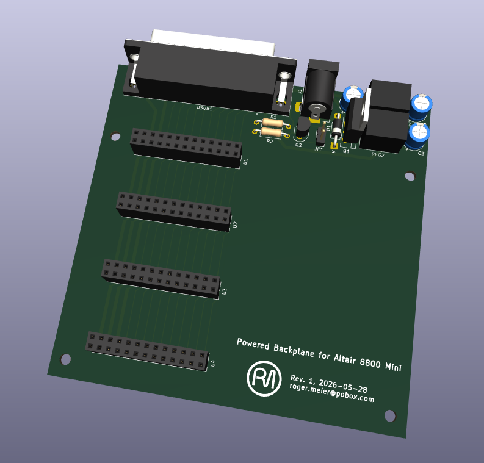

## Sense Switch Input

This version if the backplane is derived off of David Hansel's design (https://github.com/dhansel/Altair8800-IOBus/tree/main/00-backplane) but with the difference that instead of getting powere over the bus by the Altair 8800 Mini or similar device, this backplane is locally powered by an external DC supply and generates the +5V and +3.3V supplies locally.

The backplane power can be configured to be either enabled automatically via the Altair Mini, constantly enabled, or controlled with a power switch:
- Install Q1, Q2, R1, R2 for automatic power-on control via +5V from Altair Mini.
- Install jumper JP1 for constant power on.
- Install switch across JP1 for manual power switch.