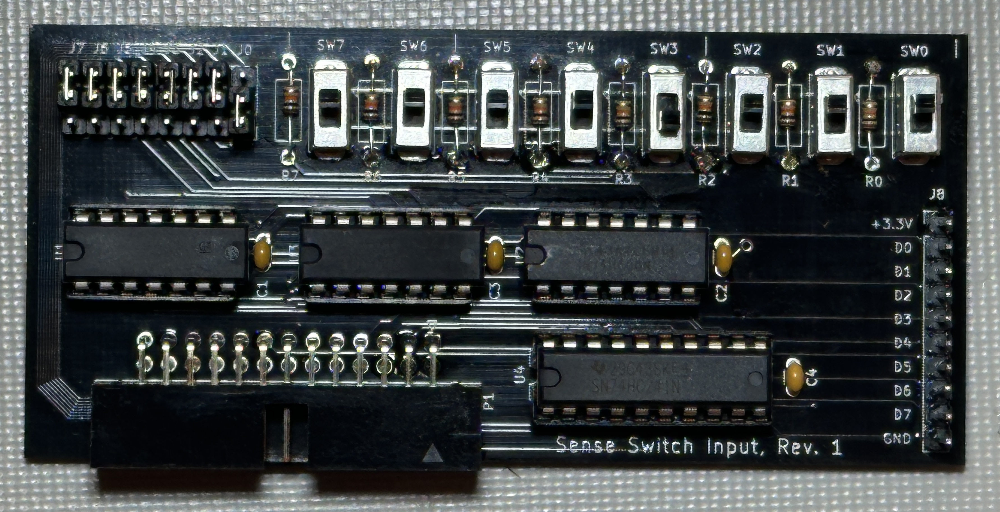

## Sense Switch Input

One of the arguably best features of machines like the Altair 8800, IMSAI 8080, etc., has always been the ability input data and control running programs with the front panel sense switches.

But have you ever wished you had an additional set of switches? 

This card provides exactly that. A set of 8 sense switches at a user-configurable I/O address. Using David Hansel's reference design for his cards, this card also includes a set of jumpers to set the I/O address. By changing the jumpers, multiple of these I/O cards can be installed at the same time and individually addressed.

The header J8 provides a means to input 8 bit data. Note that the inputs use a 3.3V logic level. Driving these inputs will override the switch settings.

To read a value from this card in BASIC, simply execute "PRINT INP(x)", where x is the address of the card.

Schematics and Gerber files for PCB production are in this directory.